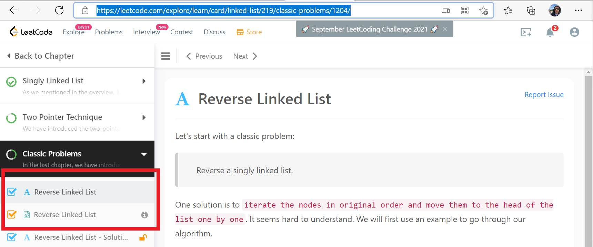
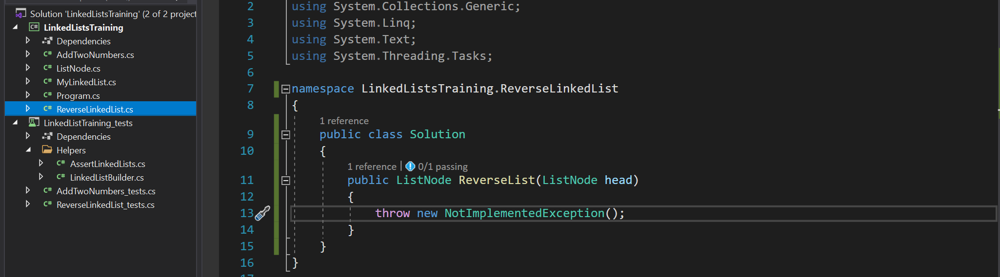
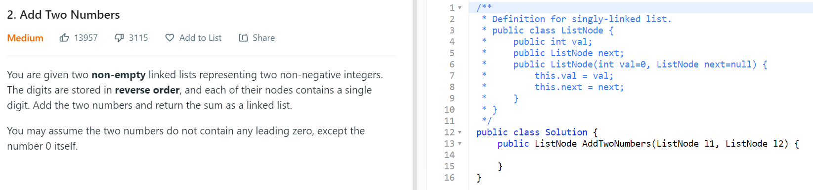
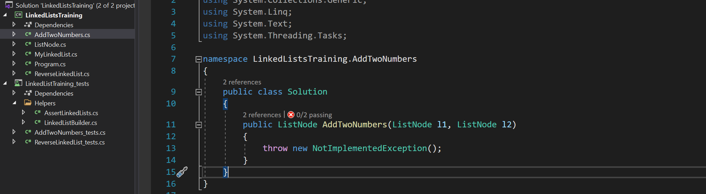

# Sorting Arrays and Traversing LinkedLists

## Summary
We will be practicing the below sorting algorithms, including
- O(n^2) Bubble Sort
- O(n^2) Selection Sort
- O(n^2) Insertion Sort
- O(lg(x) x) Merge Sort

Then we will move on to working with LinkedLists again
- Creating a linked list data structure
- Reversing a LinkedList
- Adding together the values in two linked lists


## Estimated time
Estimate time is 14 hours.

## Directions
Clone the excercise files

# Sorting
## Why are practicing these sorting algorithms?
Several of the
- Sorting algorithms are an excellent way to explore time and space complexity.
- Sorting algorithms let us see different solutions to the same problem.  Each trade off has advantages and disadvantages.
- Apprentices should feel comfortable traversing arrays, swapping array values, and looping.
- Merge sort allows us to see a O(x*lg(x)) algorithm and further explore recursion 

## Bubble Sort
*We will do bubble sort as a class.*

What is Bubble Sort?
> Bubble sort, sometimes referred to as sinking sort, is a simple sorting algorithm that repeatedly steps through the list, compares adjacent elements and swaps them if they are in the wrong order. The pass through the list is repeated until the list is sorted. The algorithm, which is a comparison sort, is named for the way smaller or larger elements "bubble" to the top of the list.
>
>The only significant advantage that bubble sort has over most other algorithms, even quicksort, but not insertion sort, is that the ability to detect that the list is sorted efficiently is built into the algorithm.
>
>[Wikipedia: Bubble Sort](https://en.wikipedia.org/wiki/Bubble_sort) 

Image of bubble sort in progress: [Bubble sort example](https://en.wikipedia.org/wiki/Bubble_sort#/media/File:Bubble-sort-example-300px.gif) 

## Selection Sort
> The algorithm divides the input list into two parts: a sorted sublist of items which is built up from left to right at the front (left) of the list and a sublist of the remaining unsorted items that occupy the rest of the list. Initially, the sorted sublist is empty and the unsorted sublist is the entire input list. The algorithm proceeds by finding the smallest (or largest, depending on sorting order) element in the unsorted sublist, exchanging (swapping) it with the leftmost unsorted element (putting it in sorted order), and moving the sublist boundaries one element to the right.
>
> [Wikipedia: Selection Sort](https://en.wikipedia.org/wiki/Selection_sort)

Image of selection sort in progress: [Selection sort example](https://en.wikipedia.org/wiki/Selection_sort#/media/File:Selection-Sort-Animation.gif)

## Insertion Sort
>Insertion sort iterates, consuming one input element each repetition, and grows a sorted output list. At each iteration, insertion sort removes one element from the input data, finds the location it belongs within the sorted list, and inserts it there. It repeats until no input elements remain.
>
> [Wikipedia- Insertion Sort](https://en.wikipedia.org/wiki/Insertion_sort)

Image of insertion sort: [Insertion sort example](https://en.wikipedia.org/wiki/Insertion_sort#/media/File:Insertion-sort-example-300px.gif)

## Merge Sort
*We will first do merge sort as a class.*

> Merge sort is a divide and conquer algorithm that was invented by John von Neumann in 1945. A detailed description and analysis of bottom-up merge sort appeared in a report by Goldstine and von Neumann as early as 1948
>
>Conceptually, a merge sort works as follows:
> - Divide the unsorted list into n sublists, each containing one element (a list of one element is considered sorted).
> - Repeatedly merge sublists to produce new sorted sublists until there is only one sublist remaining. This will be the sorted list.
>
> [Wikipedia: Merg Sort](https://en.wikipedia.org/wiki/Merge_sort)

Image of insertion sort: [Insertion sort example](https://en.wikipedia.org/wiki/Merge_sort#/media/File:Merge-sort-example-300px.gif)

Merge sort may be one of the first times using recursion and the first introduction to a divide and counquer approach to solving problmes. As a reminder, an algorithm that is recursive in structure calls itself recursively one or more times: function calls itself directly or indirectly. The divide and conquer algorithm typically follows these steps:
1)  Break the problem into subproblems that are similar in nature to the original problem but smaller in size.
2) Solve the subproblem.
3) Combine the solutions to the subproblems.

Specifically for merge sort we will be following this pattern:
1) Divide the sequence into two subsequences
2) When you can't divide the subsequences, sort the sub sequences
3) Combine the two sorted subsequences.

The reason that merge sort is faster than the other above solutions is *combining two sorted sequences is faster than, for example, placing a single item in a sorted sequence.*


---
# LeetCode & LinkedLists

## Designing a Linked List.
### Time:
Up to four hours.

### Problem
LeetCode - 

Follow the directions on leet code for designing a linked list.

This problem was selected 


# Linked Lists


## Reverse a Linked List

### Time: 
Up to two hours.

### Problem
*LeetCode* - (Training) [Reverse Linked List](https://leetcode.com/explore/learn/card/linked-list/219/classic-problems/1204/*)

*LeetCode* -  (Problem) [Reverse Linked List](https://leetcode.com/explore/learn/card/linked-list/219/classic-problems/1205/*)

Read the problem [Reverse Linked List](https://leetcode.com/explore/learn/card/linked-list/219/classic-problems/1204/).  This problem is the foundation of many linked list problems, having us both traverse through a list while changing pointers.  Then [do the problem](https://leetcode.com/explore/learn/card/linked-list/219/classic-problems/1205/*).

Work this problem in the provided solution *LinkedListsTraining.*  Then you may copy and paste your solution in the LeetCode site.


This problem does not require that much code to solve, but it may take expirementation and practice.  Take a break when you need to.  A similar concept used in sorting would be swapping the values at index i and k below;

```csharp
var temp = arr[i];
arr[i] = arr[k];
arr[k] = temp;
```
After the test case section below is a hint section for solving the problem.  This hint may be helpful.  Don't let the approach below confuse you.

**Test Cases**


| | Can reverse list of five number|
|:-- | :-- |
| input | 1, 2, 3, 4, 5 | 
| Output | 5, 4, 3, 2, 1 |

*What other tests can you add?  What if the list only has one item?  What if the list is empty?* 

**Hint for** *Reverse Linked List*
```csharp
public ListNode ReverseList(ListNode head)
{
    ListNode prev = null;
    ListNode curr = head;
    ListNode next;

    while (curr != null)
    {
      //What code could go here
    }

    return prev;
}

```
---

## Add two numbers

### Time: 
Challanging (up to three hours).  You may not finish.

### Problem
*LeetCode* [Add two number](https://leetcode.com/problems/add-two-numbers/)

Read the problem [Add two numbers](https://leetcode.com/problems/add-two-numbers/).  This was the most popular question answered at LeetCode at one time because it was previously stated to be the most popular question asked during an interview.  It's listed at as a meduimly hard question on LeetCode.

This problem was selected *not becuase it was a popular interview question* but becuase it's excellent problem to follow our test driven development best practices like breaking a problem down into parts through writing a test then refactoring.  A list of recommended tests have been outlined below with hints.  Instead of trying to write an answer that passes all the tests, try to write and then pass one test at a time.  You may find the hints and code samples helpful; don't allow them to lead you astray.

Make sure your approach is storing your information in a new linked list and not temporarily storing long numbers in System.Int64, an Array, or `List<int>`.

Work this problem in the provided solution *LinkedListsTraining.*  Then you may copy and paste your solution in the LeetCode site.


**Test Cases**

| | Can add two single digit numbers|
|:-- | :-- |
| l1 | 1 | 
| l2 | 2|
| Output | 3 |

*Hint: We are going to be returning the head of a ListNode.  We will need to keep track of both the tail and head.  The tail will be where we add the next node with the value.  The head will be what we return when we are finished.
```csharp
// Example of one way to set the head or the tail.  This section is missing

// At the top we might have
ListNode head = null;
ListNode tail = null;

// Other code goes here
 
// If there are no nodes yet, set head and tail to the first node.  Otherwise add a new node to the tail.
if (head == null)
{
    tail = head = new ListNode(total);
}
else
{
    tail = tail.next = new ListNode(total);
}

```

|  | Can add two numbers that are the same length |
|:-- | :-- |
| l1 | 1, 1, 1| 
| l2 | 2, 2, 2|
| Output | 3, 3, 3|

*Hint: We are probably going to need at least one while loop to move through the linked lists.*

|  | Can add two numbers that are different lengths |
|:-- | :-- |
| l1 | 1, 1 | 
| l2 | 2, 2, 2|
| Output | 3, 3, 2|

*Hint: While we only need one while loop, we proabably only want to get the value from a node and move onto the next node if the current node is not null.*

|  | Can add two numbers that are different lengths |
|:-- | :-- |
| l1 | 1 | 
| l2 | 2, 2, 2|
| Output | 3, 2, 2|

|  | Can add if number is zero |
|:-- | :-- |
| l1 | 0 | 
| l2 | 2, 2, 2|
| Output | 2, 2, 2|

|  | Can add if both numbers are zero |
|:-- | :-- |
| l1 | 0 | 
| l2 | 0|
| Output | 0|


|  | Can simple carry |
|:-- | :-- |
| l1 | 2, 8, 2| 
| l2 | 2, 2, 2|
| Output | 4, 0, 5|

*Hint: We probably want to check if the value of the two numbers is over nine, if it is, we want add one to the carry and subract 10 from the current total.
``` csharp
//Just an example.  There are other valid solutions
if (total > 9)
{
    total = total - 10;
    carry = 1;
}
```

|  | Can carry at the end |
|:-- | :-- |
| l1 | 2, 2, 8| 
| l2 | 2, 2, 3|
| Output | 4, 4, 1, 1|

|  | Can complicated carry |
|:-- | :-- |
| l1 | 9, 9, 9| 
| l2 | 9, 9, 9, 9, 9, 9, 9|
| Output | 8, 9, 9, 0, 0, 0, 0, 1|

|  | Can add long numbers |
|:-- | :-- |
| l1 |     9, 9, 9, 9, 9, 9, 9, 9, 9, 9, 9, 9, 9, 9, 9, 9, 9, 9, 9, 9, 9| 
| l2 |     9, 9, 9, 9, 9, 9, 9, 9, 9, 9, 9, 9, 9, 9, 9, 9, 9, 9, 9, 9, 9|
| Output | 8, 9, 9, 9, 9, 9, 9, 9, 9, 9, 9, 9, 9, 9, 9, 9, 9, 9, 9, 9, 9, 1|